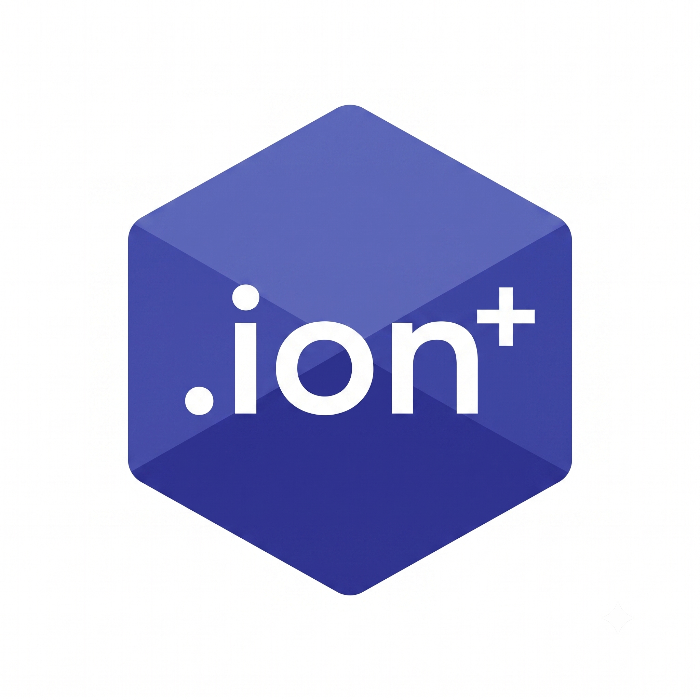
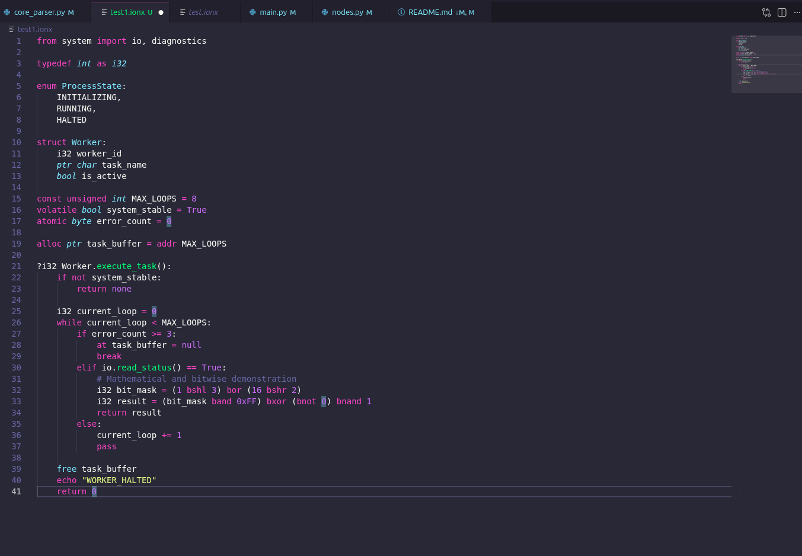

# Ion+ ( [`ion-plus`](https://github.com/YashAryaPersonal/ion-plus) )

<div align="center"></div>
<<<<<<< HEAD
=======
Ion+ is a low-level programming language project built in Python, with an architecture designed to eventually support LLVM-based code generation. The project currently focuses on the frontend pipeline: lexing source code, tokenizing language constructs, detecting indentation, and defining a rich AST model for future parsing and execution. Its main focus is to make a easier version of C++ with OOP.
>>>>>>> 57210e548d10b17c70793241cc8ce89ab704a4f8

Ion+ is a low-level, systems-inspired programming language built in Python as a compiler project focused on frontend architecture, parser design, AST generation, and language experimentation. The project is evolving from a lexer and token stream into a more capable language pipeline where variable understanding, declaration parsing, and node construction are becoming important building blocks for the next stages of the compiler.

This repository is a working prototype for a language that mixes ideas from low-level C-style systems programming with a cleaner, modern syntax and a Pythonic developer experience. The core goal is to create a language that is easier to understand and extend than raw C++ while still supporting memory awareness, low-level operations, and structured logic.

The project is still in active development, but it has already reached a meaningful step forward: the parser now understands variable declarations and basic language structure, and the AST system is able to represent program nodes in a meaningful way for future semantic analysis and code generation.

### [https://github.com/YashAryaPersonal/ion-plus](https://github.com/YashAryaPersonal/ion-plus)
### [ion-plus-preview.onrender.com](https://ion-plus-preview.onrender.com/)

### [ion-plus-preview.onrender.com](https://ion-plus-preview.onrender.com/)

<div align="center">

## We need developers and contributors

Ion+ is still under active construction, and we welcome contributors who are passionate about compilers, parsing, AST design, low-level language design, Python tooling, and future LLVM integration.

If you want to help improve the lexer, build better parser logic, work on semantics, add type checking, or shape the future of the language syntax, this project is a strong place to contribute. We are building a language that wants to become a powerful OOP low-level language, and we need thoughtful developers to help make that vision real.

</div>

---

## Overview

Ion+ is designed as a modern low-level language experiment with a readable block structure, type-based declarations, memory concepts, and future backend code generation. It is inspired by systems languages while keeping the project approachable enough for language engineering experiments in Python.

The project currently covers the following major frontend pieces:

- Lexing source files into tokens
- Recognizing keywords, operators, literals, punctuation, and type names
- Handling indentation and block structure
- Building AST node definitions for expressions and statements
- Reading declarations and variables in a parser
- Preparing the system for semantic analysis and backend generation

The intended architecture is:

Python source -> lexer -> tokens -> indentation handling -> parser -> AST -> semantic analysis -> backend -> LLVM / code generation

This means Ion+ is not just a syntax toy; it is evolving into a real compiler pipeline project with a clear roadmap.

---

## Latest Progress

The latest update to the project includes the following meaningful improvements:

- Added variable-aware parsing logic in the parser layer
- Improved AST structure for declarations, statements, and expressions
- Added support for variable declaration interpretation in the parser
- Continued expansion of operators, literal handling, and typed declarations
- Kept the lexer pipeline actively connected to parsing for real source-file testing
- Added a stronger frontend foundation for future semantic passes

This is a very important milestone because parser logic is where a language starts to become "understandable" instead of just tokenized. In other words, the project is no longer only scanning text; it is beginning to understand the structure of declarations and variables in a source program.

In the current parser implementation, the language is able to handle variable declarations and basic parsing flow in a meaningful way. That is the direct result of the newer work in [Parser/core_parser.py](Parser/core_parser.py) and the AST definitions in [Parser/nodes.py](Parser/nodes.py).

---

## What the Project Can Do Right Now

Ion+ is currently a frontend-driven compiler prototype. It can:

- Parse source code from .ionx files
- Tokenize keywords, literals, identifiers, punctuation, and operators
- Insert indentation-level tokens when needed
- Build AST-like data structures from declarations and expressions
- Understand variable declarations, modifiers, and typed assignment patterns
- Display parsed output in a readable format through Python printing

This is enough to test language syntax and structure before implementing deeper semantic validation or LLVM code generation.

---

## Variable Understanding and Parser Progress

One of the biggest recent additions is the variable understanding parser.

The parser now demonstrates a stronger awareness of the language's declaration patterns, including:

- Data types such as int, float, bool, byte, char, ptr, and none
- Modifier support such as const, atomic, alloc, unsigned, and volatile
- Variable assignment handling
- Declaration flow for typed identifier creation
- Basic AST creation for variables and expression structure

This is done in the parser logic inside [Parser/core_parser.py](Parser/core_parser.py), where it checks the token sequence and turns them into objects such as VariableDeclaration, Identifier, IntegerLiteral, and other AST nodes defined in [Parser/nodes.py](Parser/nodes.py).

The current model is still simple, but it is a real step toward building a meaningful language parser instead of only a lexer.

---

## Current Project Status

The current repository is in the early-to-mid frontend stage. It includes:

- A regex-based lexer for source scanning
- Token definitions with typed categories
- Post-processing for indentation and block awareness
- AST classes for declarations, expressions, statements, and control flow
- A parser that understands variable declarations and program structure
- Sample language files to simulate syntax and parser behavior

It still does not yet have a complete backend or execution engine, but the core frontend is beginning to resemble an actual compiler foundation rather than just a token experiment.

---

## Architecture and Flow

The intended pipeline for Ion+ is:

1. Read source code from a .ionx file
2. Lex the file into token objects
3. Post-process indentation and block structure
4. Parse code into AST nodes
5. Validate declarations and expressions
6. Build semantic data and type relationships
7. Generate LLVM IR or backend output
8. Execute or compile the result

Right now, the project is mainly in stages 1 through 4, with strong momentum in variable understanding and AST creation.

### 1. Source Input

Ion+ reads code from files such as:

- [test.ionx](test.ionx)
- [test1.ionx](test1.ionx)
- [test2.ionx](test2.ionx)

These files act as examples of the language syntax and allow developers to write test programs, try parser behavior, and inspect how the language is evolving.

### 2. Lexing

The lexer is implemented in [Lexer/scanner.py](Lexer/scanner.py) and is responsible for scanning the text file and converting it into structured tokens. It recognizes:

- Keywords like if, while, return, struct, enum, sizeof, import
- Data types like int, float, bool, char, byte, ptr, none
- Operators like +, -, *, /, %, ==, <=, >=, +=, -=
- Literals like integers, floats, strings, booleans, binary values, and hex values
- Identifiers and punctuation

### 3. Token Definitions

The token system is defined in [Lexer/tokens.py](Lexer/tokens.py). It organizes the language into explicit categories so the parser can react to meaningful token groups instead of raw text.

Examples include:

- COMMENT, NEWLINE, WHITESPACE, EOF, INDENT, DEDENT
- DT_INT, DT_FLOAT, DT_CHAR, DT_BOOL, DT_BYTE, DT_PTR, DT_NONE
- KW_IF, KW_ELSE, KW_WHILE, KW_RETURN, KW_STRUCT, KW_ENUM, KW_IMPORT
- OP_ADDITION, OP_SUBTRACTION, OP_ASSIGNMENT, OP_EQUAL_TO, OP_LESS_THAN
- INTEGER_LITERAL, FLOAT_LITERAL, STRING_LITERAL, CHARACTER_LITERAL

### 4. Indentation Handling

The post-processing stage lives in [Lexer/post_lexer.py](Lexer/post_lexer.py). It reads the raw token data and adds indentation tokens when new blocks begin or end. This is important for block-based language syntax, similar to Python-like languages.

### 5. AST and Parser Design

The AST definitions live in [Parser/nodes.py](Parser/nodes.py). This file contains the root node model and all the declaration, expression, statement, and control-flow node types, including:

- Program
- Identifier
- IntegerLiteral, FloatLiteral, StringLiteral, CharLiteral, BooleanLiteral
- BinaryExpression, InfixExpression, UnaryExpression
- AssignmentExpression
- CallExpression, MemberExpression, SizeOfExpression
- VariableDeclaration
- FunctionDeclaration
- StructDeclaration, EnumDeclaration
- IfStatement, WhileStatement
- ReturnStatement, BreakStatement, ContinueStatement, PassStatement
- EchoStatement, ImportStatement

The parser in [Parser/core_parser.py](Parser/core_parser.py) is what turns token sequences into those node objects and begins giving the language a structure it can reason about.

---

## Full Project Directory Overview

Here is the full current project layout and what each file/folder is for:

### Root files

- [README.md](README.md)  
  Project overview, setup instructions, language explanation, examples, and contributor documentation.

- [main.py](main.py)  
  Main runtime entry point for testing the current lexer and parser pipeline. It reads source code from a file, scans it, and prints tokens and parsed output.

- [LICENSE](LICENSE)  
  Licensing information for the project.

- [LOGO.png](LOGO.png)  
  Project logo used at the top of the README and branding for the language project.

- [test.ionx](test.ionx)  
  Larger sample language file demonstrating a more complete syntax with declarations, enums, structs, memory, bitwise logic, and function-like blocks.

- [test1.ionx](test1.ionx)  
  Additional sample source file used for general testing and development of parser behavior.

- [test2.ionx](test2.ionx)  
  Simpler validation-focused sample that shows a struct and a method-like declaration pattern, useful for parser and AST testing.

### Lexer folder

- [Lexer/__int__.py](Lexer/__int__.py)  
  Package marker for the lexer module.

- [Lexer/scanner.py](Lexer/scanner.py)  
  Core lexer file that scans raw source text and produces token data.

- [Lexer/tokens.py](Lexer/tokens.py)  
  Token enum definitions and token metadata used by the lexer and parser.

- [Lexer/post_lexer.py](Lexer/post_lexer.py)  
  Post-processing layer that handles indentation, block boundaries, and prepares token streams for parsing.

### Parser folder

- [Parser/__init__.py](Parser/__init__.py)  
  Parser package entry file.

- [Parser/nodes.py](Parser/nodes.py)  
  AST definitions for all language constructs, used for representing parsed code.

- [Parser/core_parser.py](Parser/core_parser.py)  
  Main parser implementation, responsible for reading token streams and constructing node trees.

### Errors folder

- [Errors/__int__.py](Errors/__int__.py)  
  Package marker for the error utilities.

- [Errors/err.py](Errors/err.py)  
  Error definitions and reporting system for syntax and lexical issues.

### .vscode folder

- [.vscode/extensions](.vscode/extensions)  
  Contains the editor extension setup used to add syntax highlighting for Ion+ files.

- [.vscode/extensions/ion-plus/package.json](.vscode/extensions/ion-plus/package.json)  
  VS Code extension manifest for the Ion+ language definition. It registers the .ionx file extension and associates it with the correct syntax grammar.

- [.vscode/extensions/ion-plus/syntaxes](.vscode/extensions/ion-plus/syntaxes)  
  Grammar files that provide syntax highlighting support for Ion+ source files.

- [.vscode/extensions/ion-plus/language-configuration.json](.vscode/extensions/ion-plus/language-configuration.json)  
  VS Code language configuration for auto-closing brackets, comments, and other editor behavior for Ion+ files.

This folder is useful for making the project feel more complete inside VS Code. It gives Ion+ files a dedicated language identity and makes development smoother when editing .ionx source files.

---

## Example Code from test.ionx

The project includes a larger demonstration program in [test.ionx](test.ionx). This file shows a richer version of the language and demonstrates the direction of the syntax.

```ionx
# --- ION+ COMPREHENSIVE TEST SCRIPT ---
from kernel import memory, hardware

typedef byte as u8

enum NetworkState:
    DISCONNECTED,
    CONNECTING,
    CONNECTED

struct Node:
    int node_id
    ptr char ip_address
    bool is_active
    u8 latency

const unsigned int MAX_RETRIES = 5
volatile bool network_ready = False
atomic byte active_connections = 0

/* 
Memory allocation for the connection buffer
*/
alloc ptr buffer = addr MAX_RETRIES

?int Node.connect():
    if not network_ready:
        return none
    
    int attempts = 0
    while attempts < MAX_RETRIES:
        if active_connections >= 10:
            break
        elif hardware.ping() == True:
            active_connections += 1
            return 1
        else:
            attempts += 1
            pass
            
    return 0

?int main():
    # Mathematical and bitwise operations
    int math_test = (100 + 50 - 10 * 2 / 4) % 8
    int bit_test = (1 bshl 4) bor (16 bshr 2)
    int mask = (bit_test band 0xFF) bxor (bnot 0) bnand 1
    
    float precision_val = 3.14159
    char status_flag = 'A'
    
    int[10] node_array
    int s_size = sizeof(Node)
    
    if math_test >= 5:
        at buffer = null
        
    if hardware.id == 1:
        free buffer
        echo "SHUTDOWN_COMPLETE"
        return 1
        
    return 0
```

This example shows several of the language goals:

- typed variable declarations
- struct definitions
- enums and constants
- bitwise expressions
- memory-oriented syntax
- control flow and function-style blocks
- future support for runtime-like behavior

---

## Example Code from test2.ionx

The smaller sample in [test2.ionx](test2.ionx) is a focused validation script showing how the parser should understand a simple struct and method pattern with return values.

```ionx
/* 
Short Test: Buffer Validation
*/

struct Buffer:
    int size
    ptr byte data

?int Buffer.validate(int max_size):
    if size <= 0 or size >= max_size:
        return none
    
    int index = 0
    while index < size:
        index += 1
        
    return index
```

This example is especially useful for checking the parser’s handling of:

- struct definitions
- typed members
- function-style declarations
- boolean comparisons
- while loops
- return statements
- variable initialization inside blocks

---

## How to Run Ion+

From the project root, run:

```bash
python main.py
```

This will execute the main script defined in [main.py](main.py), which currently reads a source file, scans it with the lexer, and prints tokens. It also prints the parser output, which is the current AST representation for the source.

### Actual main.py behavior

The current script works like this:

```python
from Lexer.post_lexer import *
from Parser.core_parser import *

if __name__ == "__main__":
    with open("test1.ionx", "r") as f:
        source_code: str = f.read()

    tokens, last_line, last_col = Scan(source_code, "test2.ionx")
    parser = Parser(tokens, "test2.ionx")

    print_tokens(tokens)
    print(parser.parse())
```

This lets you:

- read a .ionx file
- run the lexer
- generate tokens
- pass the token list to the parser
- print the resulting parsed nodes / AST object

---

## How to Print the Nodes

The parser output is printed to the console using:

```python
print(parser.parse())
```

This is the critical line for seeing the AST tree. It prints the entire parsed structure generated by the parser from the input file.

If you want to inspect parsing in a custom test script, use:

```python
from Parser.core_parser import Parser
from Lexer.post_lexer import Scan

with open("test2.ionx", "r") as f:
    source = f.read()

tokens, _, _ = Scan(source, "test2.ionx")
parser = Parser(tokens, "test2.ionx")
print(parser.parse())
```

This is useful for debugging and for observing how the parser interprets variable declarations and nested language structure.

---

## Why This Project Matters

Ion+ is valuable because it combines several important ideas in one educational compiler project:

- lexical analysis
- indentation-aware scanning
- parser construction
- AST modeling
- typed variable understanding
- language design experimentation
- low-level syntax exploration
- future LLVM/backend opportunities

It is a strong project for developers who want to learn compiler architecture while also building a language that feels designed, not random.

---

## Roadmap

A realistic future roadmap for Ion+ looks like this:

### Phase 1: Frontend completion

- Finish parser coverage for declarations, expressions, and blocks
- Improve syntax handling for more language constructs
- Validate AST correctness on larger sample programs

### Phase 2: Semantics and type checking

- Add symbol table support
- Resolve identifiers and declarations
- Validate function signatures and variable usage
- Improve type checking for low-level constructs

### Phase 3: Backend integration

- Generate LLVM IR from AST nodes
- Add execution or compilation support
- Support memory operations and runtime primitives

### Phase 4: Tooling and developer experience

- CLI compiler args
- Better error output
- Syntax highlighting improvements
- More documentation and examples

### Phase 5: Language growth

- OOP support and class design
- More advanced control flow
- Better semantics and code generation pipeline

---

## Development Opportunities

There are many ways to contribute:

- Expand the lexer to cover more language syntax
- Improve variable and declaration parsing
- Add more AST node types and expression handling
- Work on control-flow analysis
- Validate parser correctness with more sample programs
- Improve error reporting and location tracking
- Build semantic analysis and type resolution
- Implement backend support for LLVM or another target
- Write documentation, tests, and examples

This project is especially good for contributors who want to understand how compilers evolve from simple scanning into full language systems.

---

## Call for Contributors

Ion+ is a promising language experiment and compiler project. It needs community support to become a serious language ecosystem, not just a frontend prototype.

We are looking for developers interested in:

- compiler design
- parser construction
- AST engineering
- Python tooling
- low-level language development
- LLVM backend work
- language spec design
- documentation and testing

If you are interested in building a new language from the ground up, Ion+ is a great space to contribute.

<div align="center">

## Join the project and help build Ion+

Contributors are welcome. If you want to help, open an issue, submit a pull request, improve the parser, write tests, or help shape the language design.

Let’s build the future of Ion+ together.

</div>

---

## Screenshot Placeholder

You can place a screenshot of the language or editor output here when you are ready:


---

## License

This project uses the repository license included in [LICENSE](LICENSE). Please review that file for usage and distribution terms. It is made under [Apache 2.0](http://www.apache.org/licenses/).

---

## Final Note

Ion+ is a steadily growing language project with a real compiler-style architecture and a much stronger parser foundation than it had before. The addition of variable understanding and AST parsing is an important milestone because it shows the project is moving from raw token recognition toward actual language comprehension.

The repository is still young, but it already contains the blueprint for a serious language frontend. With more work on parsing, semantics, and code generation, Ion+ can grow from a language experiment into a complete low-level compiler project.

**Thanks** for all **respectful** developers who are helping build the future of Ion+.
