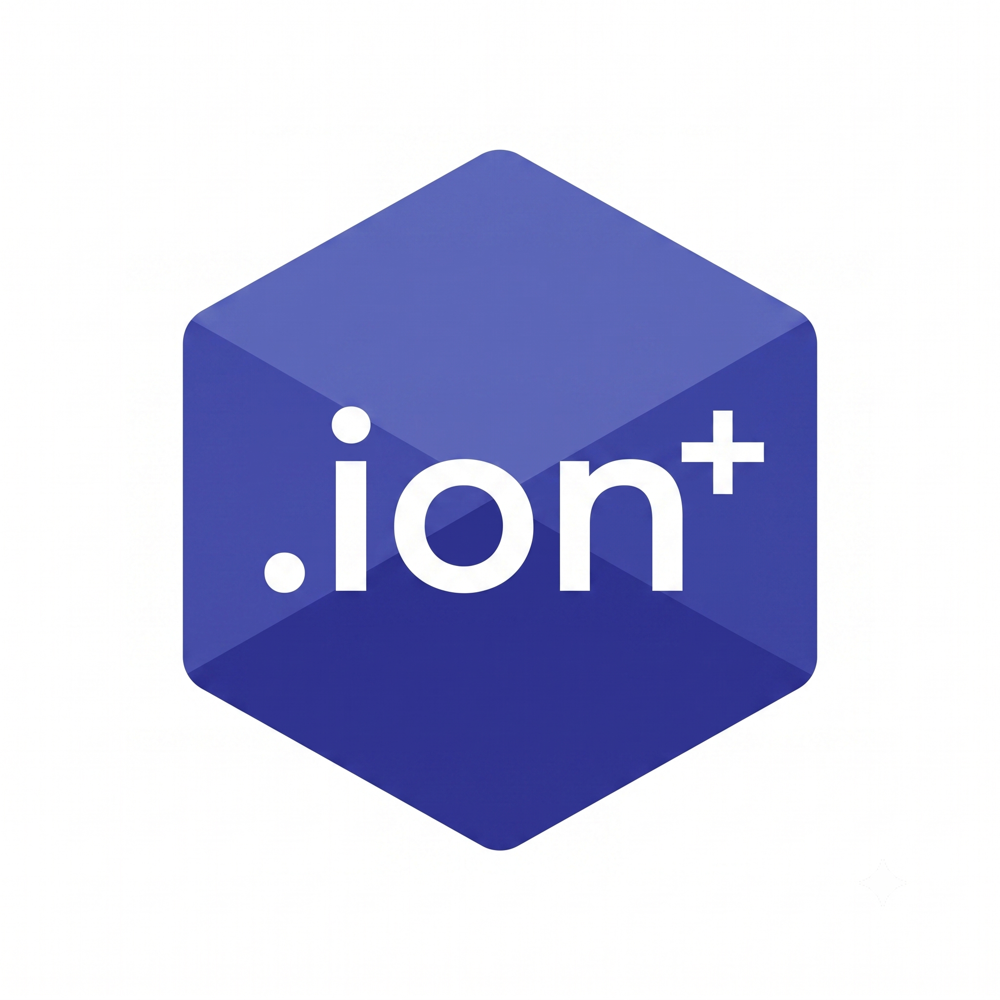
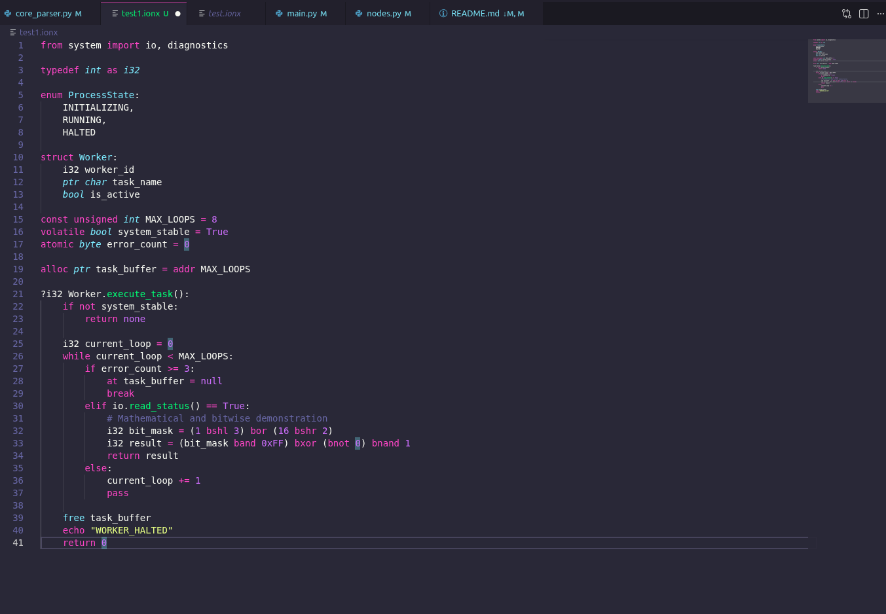

<<<<<<< HEAD
# Ion+
=======
# Ion+ ( [`ion-plus`](https://github.com/YashAryaPersonal/ion-plus) )

<div align="center"></div>

Ion+ is a low-level programming language project built in Python, with an architecture designed to eventually support LLVM-based code generation. The project currently focuses on the frontend pipeline: lexing source code, tokenizing language constructs, detecting indentation, and defining a rich AST model for future parsing and execution. Its main focus is to make a easier version of C++ with OOP.

Ion+ is a low-level, systems-inspired programming language built in Python as a compiler project focused on frontend architecture, parser design, AST generation, and language experimentation. The project is evolving from a lexer and token stream into a more capable language pipeline where variable understanding, declaration parsing, and node construction are becoming important building blocks for the next stages of the compiler.

This repository is a working prototype for a language that mixes ideas from low-level C-style systems programming with a cleaner, modern syntax and a Pythonic developer experience. The core goal is to create a language that is easier to understand and extend than raw C++ while still supporting memory awareness, low-level operations, and structured logic.

The project is still in active development, but it has already reached a meaningful step forward: the parser now understands variable declarations and basic language structure, and the AST system is able to represent program nodes in a meaningful way for future semantic analysis and code generation.

### [https://github.com/YashAryaPersonal/ion-plus](https://github.com/YashAryaPersonal/ion-plus)
### [ion-plus-preview.onrender.com](https://ion-plus-preview.onrender.com/)
>>>>>>> ef7d48207bfb4fdb59bcb47042e2b13468f61a0a

<div align="center">
  
</div>

Ion+ is a small compiler-style project in Python. It is focused on the frontend side of a language: scanning source code, turning it into tokens, handling indentation, building a parser, and creating AST nodes for future work like type checking and code generation.

Created by: **Yash Arya** — a 14-year-old teen developer.

Website: [ion-plus-preview.onrender.com](https://ion-plus-preview.onrender.com/)  
GitHub: [ion-plus](https://github.com/YashAryaPersonal/ion-plus)

---

## What Ion+ does

Right now, the project can:

- read `.ionx` source files
- tokenize keywords, operators, literals, and identifiers
- detect indentation and block structure
- parse declarations and basic expressions
- build AST-like structures for future compiler stages

This is still early, but the idea is there: a low-level, C-like language with cleaner syntax and a simpler frontend foundation.

---

## Project map

```text
ion-plus/
├── LICENSE
├── README.md
├── .gitignore
├── compiler/
│   ├── __init__.py
│   ├── Errors/
│   │   ├── __int__.py
│   │   └── err.py
│   ├── Lexer/
│   │   ├── __int__.py
│   │   ├── post_lexer.py
│   │   ├── scanner.py
│   │   └── tokens.py
│   └── Parser/
│       ├── __init__.py
│       ├── core_parser.py
│       ├── main_parser.py
│       ├── nodes.py
│       └── pratt_parser.py
├── src/
│   ├── LOGO.png
│   └── screenshot.png
├── test/
│   ├── __init__.py
│   ├── main.py
│   ├── test.ionx
│   ├── test1.ionx
│   └── test2.ionx
└── .vscode/
```

### Quick guide

- [compiler](compiler) — main compiler code, lexer, parser, and error handling
- [compiler/Lexer](compiler/Lexer) — token generation and indentation logic
- [compiler/Errors](compiler/Errors) — error reporting and exception helpers
- [compiler/Parser](compiler/Parser) — parser logic and AST construction
- [src](src) — project logo and screenshots
- [test](test) — sample scripts and `.ionx` test files

---

## How it works

The basic flow is simple:

1. Read a `.ionx` file
2. Scan it into tokens
3. Handle indentation and blocks
4. Parse tokens into AST nodes
5. Prepare for semantic work later

This project is mostly frontend-focused right now, but the structure is already there for more compiler features later.

---

## Run it

From the project root:

```bash
python test/main.py
```

### Quick Output:
```py
Program(
  line=1, 
  col=0, 
  body=[
    VariableDeclaration(
      line=1, 
      col=16, 
      type=Int(line=1, col=20, is_custom=False), 
      identifier=Identifier(line=1, col=20, value='x'), 
      value=IntegerLiteral(line=1, col=26, value='10'), 
      modifiers=[Const(line=1, col=7), Volatile(line=1, col=16)]
      )
    ], 
  name='test2.ionx'
)
```

This runs the sample parser/lexer test flow and prints the parsed output.

---

## Example

This is the kind of syntax the project is aiming for:

```ionx
struct Buffer:
    int size
    ptr byte data

?int Buffer.validate(int max_size):
    if size <= 0 or size >= max_size:
        return none
    return size
```

It is meant to feel like a low-level C-like language, but with a cleaner and more readable syntax.

---

## Current status

Ion+ is still in early development. The lexer and parser are working, and the AST is growing. There is no full backend or execution engine yet, and the project is still being built piece by piece.

The parser still needs more work, especially in [compiler/Parser/pratt_parser.py](compiler/Parser/pratt_parser.py).

---

## Screenshot

<div align="center">
  
</div>

---

## License

This project is under the MIT license. See [LICENSE](LICENSE).

I made this project to learn more about compilers, parsing, and language design, and to build something practical from scratch. It is still growing, but the base is there.
